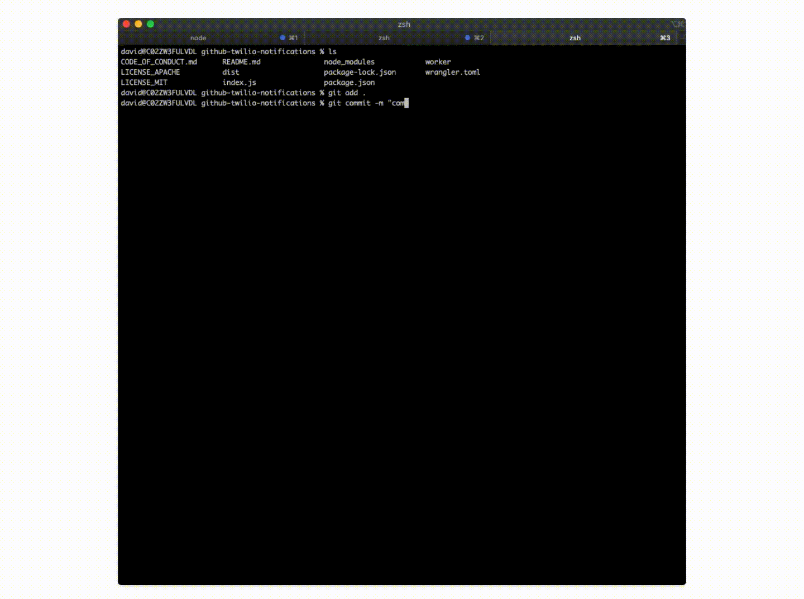

<!-- To Do:
 - fix error coding http 200 / 400 /etc
 - should we add more simpleRequests to a standard lib?
 -->

# GitHub repo notifications with Twilio

In this tutorial, you will build an SMS notification system on Workers to receive updates about one of your GitHub repos. Whenever there is new activity on your GitHub repo, your worker will send you a text using Twilio.

You’ll learn how to:
- Build webhooks using Workers
- Integrate Workers with GitHub and Twilio
- use Worker secrets with wrangler



## Prerequisites

You will need a Worker and a GitHub repository to get started.

To set up a Worker, you should have a:

- A Cloudflare account, and access to the API keys for that account
- A Wrangler installation running locally on your machine, and access to the command-line

Follow our [Workers Quickstart Guide](https://developers.cloudflare.com/workers/quickstart) to set up your local development environment and create a Cloudflare account.

If you don't have a GitHub repo or account, you can create one on [GitHub](wwww.GitHub.com) and [create a new repo](https://docs.GitHub.com/en/GitHub/getting-started-with-GitHub/create-a-repo).

### Generate

Cloudflare’s command-line tool for managing Worker projects, Wrangler, has great support for templates — pre-built collections of code that make it easy to get started writing Workers. In this tutorial, you’ll use the default JavaScript template to generate a Workers project.

In the command line, generate your Worker project, passing in a project name (e.g. `github-twilio-notifications`):

```sh
---
header: Generate a project
---
wrangler generate github-twilio-notifications
cd github-twilio-notifications
```

Wrangler templates are just Git repositories, so if you want to create your own templates, or use one from our [Template Gallery](/templates), there’s a ton of options to help you get started.

Wrangler’s default template includes support for building and deploying JavaScript-based projects, including Webpack support. Inside of your new `github-sms-notifications` directory, `index.js` represents the entry-point to your Cloudflare Workers application.

Awesome, you are ready to go now after finishing the prerequisites section.

First, we'll create a webhook for your GitHub repo to post updates to your worker. Inside of your worker, we'll parse the updates GitHub. Finally, we'll send a POST request to Twilio to send a text message to you.

You can reference the finished code on this [GitHub repository](https://github.com/davidtsong/github-twilio-notifications/)

---- 


## Configure GitHub

The first step is to configure a GitHub webhook to post to our Worker when there is an update to the repo.

Click on the "Settings" tab for your repo and then click on the "Webhooks" page from the list on the left. Click "Add webhook" and configure the "Payload URL" with your worker URL. You can find your worker URL by running "wrangler publish" in your command line to generate a live link for your Worker. For the "Content type", choose "application/json". Generate a secret key of your choice and set it as the "Secret". Click "Let me select individual events" for which events to trigger the webhook. Select the events you want to get notifications for. (I selected "Pull requests", "Pushes", and "Branch or tag creation") Finally, click "Add webhook" to finish our work on the GitHub side.


## Parsing the Response

With your local environment setup, we will now parse the repo update from GitHub with your worker. If you get stuck, you can refer to the finished [index.js](https://GitHub.com/davidtsong/GitHub-twilio-notifications/blob/master/index.js). 

Your generated `index.js` should look like this below:

```javascript
---
filename: index.js
---
addEventListener('fetch', event => {
  event.respondWith(handleRequest(event.request))
})
/**
 * Respond with hello worker text
 * @param {Request} request
 */
async function handleRequest(request) {
  return new Response('Hello worker!', {
    headers: { 'content-type': 'text/plain' },
  })
}
```

Let's start and refactor the starter code to handle a `POST` response and rename the request handler. We can use the `request.method` property of [request](/runtime-apis/request) to check if the request is a `POST` request, and send an error response if incorrect. The `simpleResponse` function is an easy wrapper for you to send requests with your Worker.

```javascript
---
filename: index.js
---
function simpleResponse(statusCode, message) {
  let resp = {
    message: message,
    status: statusCode
  }

  return new Response(JSON.stringify(resp), {
    headers: { "Content-Type": "application/json" },
    status: statusCode
  })
}

addEventListener("fetch", event => {
  event.respondWith(githubWebhookHandler(event.request))
})

async function githubWebhookHandler(request) {
  if (request.method !== "POST") {
    return simpleResponse(
      200,
      `Please send a POST request :)`
    )
  }
}
```

Next, we'll validate that the request is sent with the right secret key. GitHub attaches a hash signature for each payload using the secret key ([see the docs for more details](https://developer.github.com/webhooks/securing/)). We can use a helper function called `checkSignature` on the request to ensure the hash is correct. Then, we can access data from the webhook by parsing the request as JSON.

```javascript
---
filename: index.js - githubWebhookHandler()
---
async function githubWebhookHandler(request) {
  if (request.method !== "POST") {
    return simpleResponse(
      200,
      `Please send a POST request :)`
    )
  }
  try {
    const formData = await request.json()
    const headers = await request.headers
    const action = headers.get("X-GitHub-Event")
    const repo_name = formData.repository.full_name
    const sender_name = formData.sender.login 

    if (!checkSignature(formData, headers)) {
      return simpleResponse(403, "Wrong password, try again :P")
    }

  } catch (e) {
    return simpleResponse(
      200,
      `Error:  ${e} `
    )
  }
}

```

The `checkSignature` function will use the crypto library to hash the received payload with our known secret key to ensure it matches the request hash. GitHub uses an HMAC hexdigest to compute the hash in the sha1 format.

```javascript
---
filename: index.js
---
const crypto = require('crypto')

async function createHexSignature(requestBody) {
  let hmac = crypto.createHmac('sha1', SECRET_TOKEN)
  hmac.update(requestBody,'utf-8')

  return hmac.digest('hex')
}

async function checkSignature(formData, headers) {
  let expectedSignature = await createHexSignature(formData)
  let actualSignature = headers.get("X-Hub-Signature")

  return expectedSignature === actualSignature
}
```

Since our project relies on importing a library, we need to also update our `wrangler.toml` and set `type = "webpack"`.

Your `wrangler.toml` shuold look something like this:
```yaml
name = "nameless-bonus-1fdf"
type = "webpack"
account_id = "xxxxxxxxx"
workers_dev = true
route = ""
zone_id = ""
```

## Sending a Text with Twilio

Finally, we will send a text message to you with the GitHub repo update info using Twilio. You'll need a Twilio account and number to send texts so follow [this guide to get setup](https://www.twilio.com/sms/api). FYI, Twilio has this [pretty awesome game](https://www.twilio.com/quest) where you can learn how to use their platform and get some free credits while you are at it.

Then, we can create a helper function to send text messages for us by sending a post request to the Twilio API endpoint. [Refer to the Twilio reference here](https://www.twilio.com/docs/sms/api/message-resource#create-a-message-resource) to learn more about this endpoint.

We construct our headers and body in the format shown in the Twilio reference. Change the `from` value to your Twilio Phone number.

```javascript
---
filename: index.js - sendText()
---
async function sendText(message){
  const endpoint = "https://api.twilio.com/2010-04-01/Accounts/" + ACCOUNT_SID + "/Messages.json"

  let encoded = new URLSearchParams()
  encoded.append("To", RECIPIENT)
  encoded.append("From", '+19388887573')
  encoded.append("Body", message)
  
  let token = btoa(ACCOUNT_SID + ":" + AUTH_TOKEN)

  const request = {
    body: encoded,
    method: 'POST',
    headers: {
      "Authorization": `Basic ${token}`,
      "Content-Type": "application/x-www-form-urlencoded"
    }
  }

  let result = await fetch(endpoint, request)
  result = await result.json()

  return new Response(JSON.stringify(result), request)
}
```
In order to make this work, we need to set some secrets to hide your `ACCOUNT_SID` and `AUTH_TOKEN` from the source code. You can set secrets as such to get a prompt for the value of the secret name you input:

```sh
wrangler secret put ACCOUNT_SID
```

Use this syntax to set your Twilio `ACCOUNT_SID`, `recipient`(your number), Twilio `AUTH_TOKEN`, and `SECRET_TOKEN` (for GitHub) to the respective values.

Finally, we modify our `githubWebhookHandler` to send a text at the end.

```javascript
async function githubWebhookHandler(request) {
  if (request.method !== "POST") {
    return simpleResponse(
      200,
      `Please send a POST request :)`
    )
  }
  try {
    const formData = await request.json()
    const headers = await request.headers
    const action = headers.get("X-GitHub-Event")
    const repo_name = formData.repository.full_name
    const sender_name = formData.sender.login 

    if (!checkSignature(formData, headers)) {
      return simpleResponse(403, "Wrong password, try again :P")
    }
    
    return await sendText(`${sender_name} casted spell: ${action} onto your repo ${repo_name}`)

  } catch (e) {
    return simpleResponse(
      200,
      `Error:  ${e} `
    )
  }
}
```

That's all :) Just use wrangler to deploy your script to Workers.
```sh
wrangler publish
```


Congrats, you finished this tutorial! Test it out and make a push to your repo and you should get a text message soon after. If you've never used Git before, here's a [quick guide](https://www.datacamp.com/community/tutorials/git-push-pull) to pushing to your repo. 

You can reference the finished code on this [GitHub repository](https://github.com/davidtsong/github-twilio-notifications/)

You've learned how to:
- Build webhooks using Workers
- Integrate Workers with GitHub and Twilio
- use Worker secrets with wrangler

Next steps:
- [Authorize users with Auth0](/tutorials/authorize-users-with-auth0)
- [JAMStack tutorial](/tutorials/build-a-jamstack-app)
- [QR Tutorial](/tutorials/build-a-qr-code-generator)
