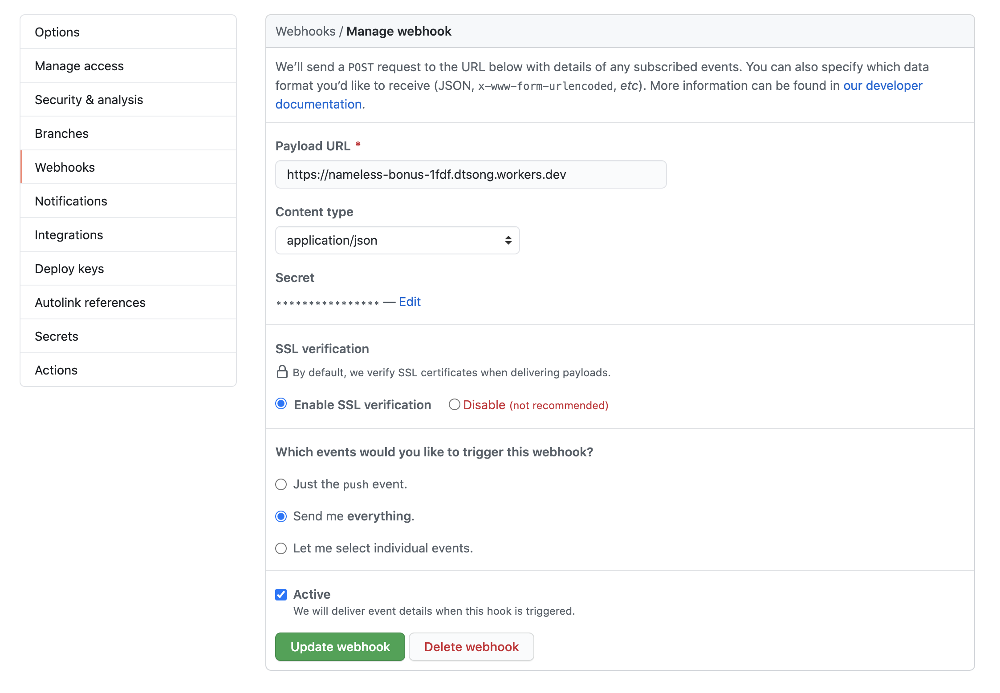

<!-- To Do:
 - fix error coding http 200 / 400 /etc
 - should we add more simpleRequests to a standard lib?
 -->

# Get texts about Github repo acitvity

In this tutorial, you will build a SMS notification system on Workers to receive updates about one of your Github repos. Your worker will text you using Twilio whenever there is a new activity on your Github repo. 

You’ll learn how to:
- use Workers with Webhooks
- Integrate Workers with Github and Twilio
- use Worker secrets with wrangler


## Prerequisites

You will need a Worker and a Github repository to get started.

To setup a Worker, you should have a:

- A Cloudflare account, and access to the API keys for that account
- A Wrangler installation running locally on your machine, and access to the command-line

Follow our [Workers Quickstart Guide](https://developers.cloudflare.com/workers/quickstart) to setup your local development environment and create a Cloudflare account.

If you don't have a Github repo or account, you can create one on [Github](wwww.github.com) and [create a new repo](https://docs.github.com/en/github/getting-started-with-github/create-a-repo).

### Generate

Cloudflare’s command-line tool for managing Worker projects, Wrangler, has great support for templates — pre-built collections of code that make it easy to get started writing Workers. In this tutorial, you’ll use the default JavaScript template to generate a Workers project.

In the command line, generate your Worker project, passing in a project name (e.g. “github-sms-notifications”):

```sh
---
header: Generate a project
---
wrangler generate github-sms-notifications
cd todos
```

Wrangler templates are just Git repositories, so if you want to create your own templates, or use one from our [Template Gallery](/templates), there’s a ton of options to help you get started.

Wrangler’s default template includes support for building and deploying JavaScript-based projects, including Webpack support. Inside of your new `todos` directory, `index.js` represents the entry-point to your Cloudflare Workers application.

All Cloudflare Workers applications start by listening for `fetch` events, which are fired when a client makes a request to a Workers route. When that request occurs, you can construct responses and return them to the user. This tutorial will walk you through understanding how the request/response pattern works, and how we can use it to build fully-featured applications.

```javascript
---
filename: index.js
---
addEventListener("fetch", event => {
  event.respondWith(handleRequest(event.request))
})
/**
 * Fetch and log a request
 * @param {Request} request
 */
async function handleRequest(request) {
  return new Response("Hello worker!", { status: 200 })
}
```

In your default `index.js` file, we can see that request/response pattern in action. The `handleRequest` constructs a new `Response` with the body text “Hello worker”, as well as an explicit status code of 200. When a `fetch` event comes into the worker, the script uses `event.respondWith` to return that new response back to the client. This means that your Cloudflare Worker script will serve new responses directly from Cloudflare's cloud network: instead of continuing to the origin, where a standard server would accept requests, and return responses, Cloudflare Workers allows you to respond quickly and efficiently by constructing responses directly on the edge.
---- 
Awesome, you should now be ready to go after finishing the prequisites section.

You can reference the finished code on this [Github repository](https://github.com/davidtsong/github-twilio-notifications/)

At a high level, we will first create a webhook for a Github repo to post an update to your worker. Then, we will parse this update from Github with your worker. Finally, we will send a POST request to Twilio to send a text message to you.

Tutorial Steps:

## 1. Configure Github

The first step is to configure a Github webhook to post to our Worker when there is an update to the repo.

Navigate to the settings page for your repo and then click on the webhooks option from the list on the left. Click add a webhook and configure it with your worker URL for the payload URL. Choose `application/json` for the content type. Generate a secret key and set it as the secret. Finally, click `Send me everything` for the which events to trigger this webhook and then click `Add webhook` to finish this first step.




## 2. Parsing the Response

With your local environment setup, we will now parse the repo update from Github with your worker. If you get stuck, you can refer to the this finished [index.js](https://github.com/davidtsong/github-twilio-notifications/blob/master/index.js). 

Your generated `index.js` should look like this below:

```javascript
---
filename: index.js
---
addEventListener("fetch", event => {
  event.respondWith(handleRequest(event.request))
})
/**
 * Fetch and log a request
 * @param {Request} request
 */
async function handleRequest(request) {
  return new Response("Hello worker!", { status: 200 })
}
```

Let's start and refactor the starter code to handle a POST response and rename the request handler. We can use the `request.method` property of [request](link to request) to check if the request is a `POST` request and send an error response if incorrect. The `simpleResponse` fucntion is an easy wrapper for you to send requests with your Worker.

```javascript
---
filename: index.js
---
function simpleResponse(statusCode, message) {
  let resp = {
    message: message,
    status: statusCode
  }

  return new Response(JSON.stringify(resp), {
    headers: new Headers([["Content-Type", "application/json"]]),
    status: statusCode
  })
}

addEventListener("fetch", event => {
  event.respondWith(githubWebhookHandler(event.request))
})

async function githubWebhookHandler(request) {
  if (request.method !== "POST") {
    return simpleResponse(
      200,
      `Please send a POST request :)`
    )
  }
}
```

The next challenge is to check validate the request is sent with the right secret key. GitHub attaches a hash signature for each payload using the secret key. [Github's Documentation](https://developer.github.com/webhooks/securing/) We can use a helper function called checkSignature on the request the hash is correct. Then, we can access data from the webhook by parsing the request as json.

```javascript
---
filename: index.js - githubWebhookHandler()
---
async function githubWebhookHandler(request) {
  if (request.method !== "POST") {
    return simpleResponse(
      200,
      `Please send a POST request :)`
    )
  }
  try{
    if (!checkSignature(request)) {
      return simpleResponse(403, "Incorrect Secret Code")
    }

    const formData = await request.json()
    const repo_name = formData.repository.full_name
    const action = await request.headers.get("X-GitHub-Event")
    const sender_name = formData.sender.login
  }
  catch (e) {
    return simpleResponse(
      200,
      `Error:  ${e} `
    )
  }
}
```

The checkSignature function will use the crypto library to hash the received payload with our known secret key to ensure it matches the request hash. GitHub uses a HMAC hexdigest to compute the hash in the sha1 format [Github's Documentation](https://developer.github.com/webhooks/securing/).

```javascript
---
filename: index.js
---

const crypto = require('crypto')

async function createHexSignature(requestBody) {
  let hmac = crypto.createHmac('sha1', SECRET_TOKEN)
  hmac.update(requestBody,'utf-8')

  return hmac.digest('hex')
}

async function checkSignature(request) {
  let expectedSignature = await createHexSignature(await request.text())
  let actualSignature = await request.headers.get("X-Hub-Signature")

  return expectedSignature === actualSignature
}
```

Since our project relies on importing a library, we need to also update our `wrangler.toml` and set `type = "webpack"`.


## 3. Sending a Text with Twilio

Finally, we will send a text message to you with the Github repo update info using Twilio. You'll need a Twilio account and number to send texts so follow [this guide to get setup](https://www.twilio.com/sms/api). FYI, Twilio has this [pretty awesome game](https://www.twilio.com/quest) where you can learn how to use their platform and get some free credits while you are at it.

Then, we can create a helper function to send text messages for us by sending a post request to the Twilio API endpoint. [Refer to the Twilio reference here](https://www.twilio.com/docs/sms/api/message-resource#create-a-message-resource)

We construct our headers and body in the format show n in the Twilio reference. Change the from value to your Twilio Phone number.

```javascript
---
filename: index.js - sendText()
---
async function sendText(message){
  let headers = new Headers();
  headers.append("Authorization","Basic " + Buffer.from(accountSid + ":" + authToken).toString('base64'))
  headers.append("Content-Type", "application/x-www-form-urlencoded")

  const endpoint = "https://api.twilio.com/2010-04-01/Accounts/" + accountSid + "/Messages.json"

  let encoded = new URLSearchParams()
  encoded.append("To",recipient)
  encoded.append("From", '+19388887573')
  encoded.append("Body", message)

  const request = {
    body: encoded,
    method: 'POST',
    headers: headers
  }

  let result = await fetch(endpoint, request)
  result = await result.json()

  return new Response(JSON.stringify(result), request)
}
```
In order to make this work, we need to set some secrets to hide your account SID and authToken from the source code. You can set secrets as such to get a prompt for the value of the secret name you input:

```sh
wrangler secret put accountSID
```

Use this syntax to set your Twilio accountSID, recipient(your number), Twilio authToken, and SECRET_TOKEN (for Github) to the respecive values.

Finally, we modify our `githubWebhookHandler` to send a text at the end.

```javascript
async function githubWebhookHandler(request) {
  if (request.method !== "POST") {
    return simpleResponse(
      200,
      `Please send a POST request :)`
    )
  }
  try {
    if (!checkSignature(request)) {
      return simpleResponse(403, "Incorrect Secret Code")
    }

    const formData = await request.json()
    const repo_name = formData.repository.full_name
    const action = await request.headers.get("X-GitHub-Event")
    const sender_name = formData.sender.login
    
    return await sendText(`${sender_name} performed ${action} on ${repo_name}`)

  } catch (e) {
    return simpleResponse(
      200,
      `Error:  ${e} `
    )
  }
}
```

Congrats, you finished this tutorial! Test it out and make a push to your repo and you should get a text message soon after. If you've never used Git before, here's a [quick guide](https://www.datacamp.com/community/tutorials/git-push-pull) to pushing to your repo. 

You've learned how to:
- use Workers with webhooks
- Integrate Workers with Github and Twilio
- use Worker secrets with wrangler

Next steps:
- Auth0 tutorial
- JAMStack tutorial
- QR Tutorial
